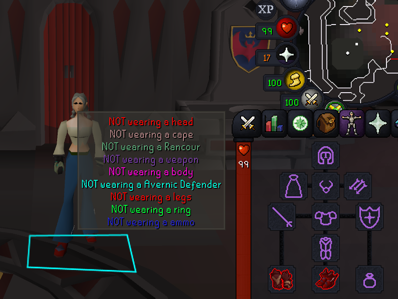

# Equipment Check

A RuneLite plugin that reminds you when a gear slot isn't holding what you
wanted — before an empty slot or the wrong item costs you.

## What it does

Every equipment slot (head, cape, amulet, ammo, weapon, shield, body, legs,
gloves, boots, ring) is set to one of three **modes**:

- **Off** — ignore the slot.
- **Empty** — warn when nothing is equipped.
- **Item-specific** — warn unless the slot holds a named item.

Item names match partially and ignore case, so `slayer helmet` covers every
variant (`Slayer helmet (i)`, `Black slayer helmet`, …). Leave the item box
blank and the slot falls back to a plain empty check.

## Context — only warn when it matters

Each slot also has a **context** dropdown, so a check only fires when it's
relevant:

- **Always** — check everywhere.
- **Wilderness** — only warn while you're in the Wilderness.

For example, require an anti-fire shield **only** in the Wilderness and stay
quiet everywhere else.

## Alerts

When a watched slot fails its check, the plugin alerts you three ways:

- a per-slot **game chat** message,
- an optional **notification** — sound, screen flash, or system tray — fired
  once per episode, and
- a live **overlay** listing each failing slot.

## Configuration

The config panel is grouped into collapsible sections:

- **Equipment Slots** — the mode, context, and required item for each slot.
- **Warning Colors** — the overlay warning color, per slot.
- **Misc.** — the notification style and the overlay background color.

## Notes

- The shield check is automatically suppressed while a two-handed weapon is
  equipped, since the shield slot is empty by design in that case.
- The plugin is purely informational — it only reads your own equipment and
  location to display reminders. It never acts on the game for you.

## Installation

Install **Equipment Check** from the RuneLite **Plugin Hub**: open the
configuration panel (the wrench icon), click **Plugin Hub** at the bottom,
search for "Equipment Check", and install.
